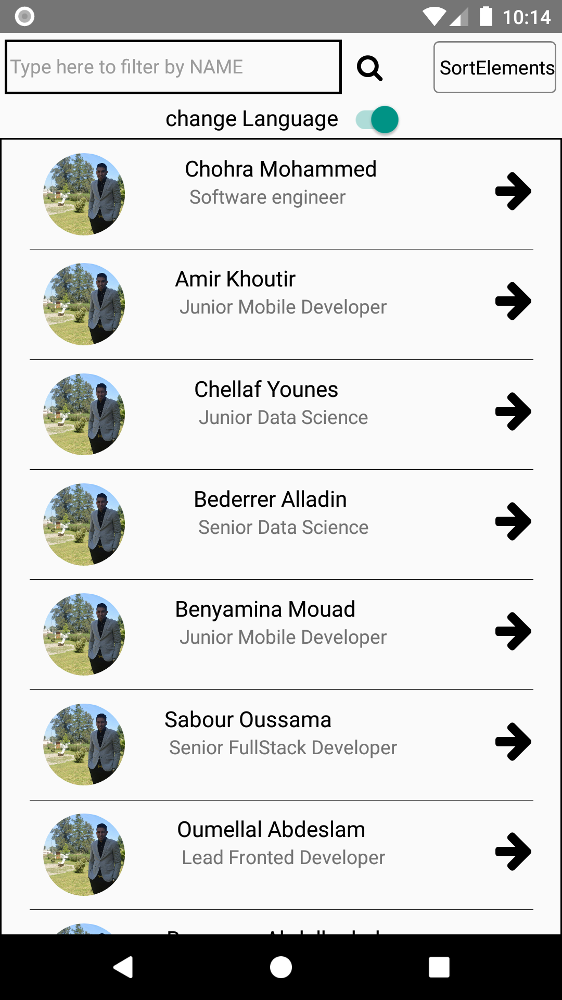
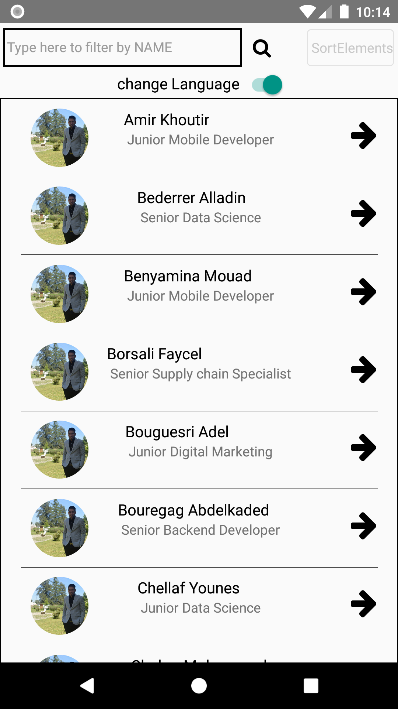
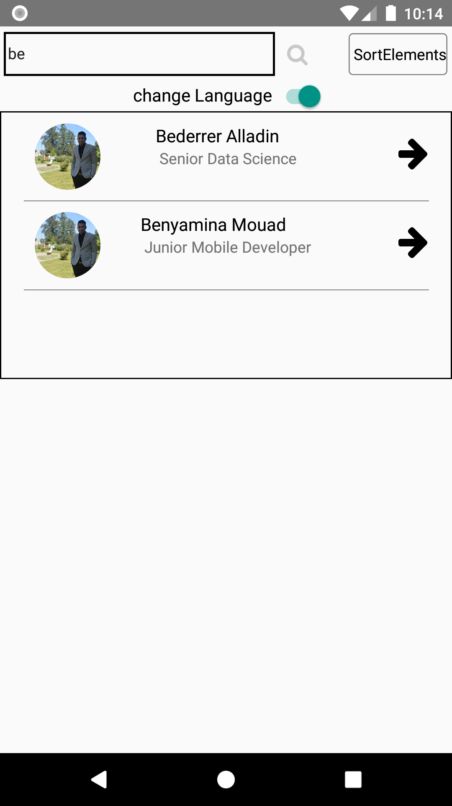
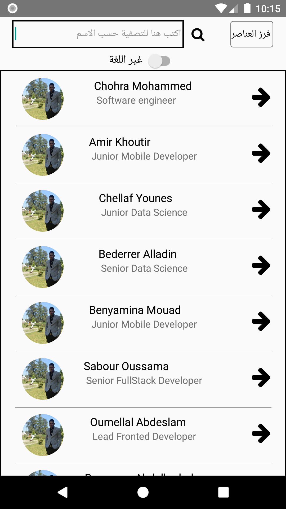

# Mentor List

> A React-Native Application that shows a List of Mentor with different functionalities

> tags: #react-native #ES6 #BABEL
>
Simple List at First         |  Sorted List By Name
:-------------------------:|:-------------------------:
  | 

Search And Filter by Name         |  Change Language
:-------------------------:|:-------------------------:
   |

> Features

- Sort the List by Name
- Search and Filter by Name 
- Change Language 
- Adding new data at the end of the list
- Refresh the List

> Structure 

- /src
    - assets:  containts all the assets (Image, Icons...)
    - Components: our Component which is the ListView Class and its Style Class
    - config : we put our configuration on the folder "right now it is empty"
    - locales: for changing the language using i18n
    - Utils: if we have some Components that are used in different components
    

## Installation

- yarn install
- react-native link
- yarn ios or yarn android

## Support

Reach out to me at one of the following places!

-  fm_chohra@esi.dz

---

## License

- **[MIT license](http://opensource.org/licenses/mit-license.php)**
- Copyright 2019 © 
